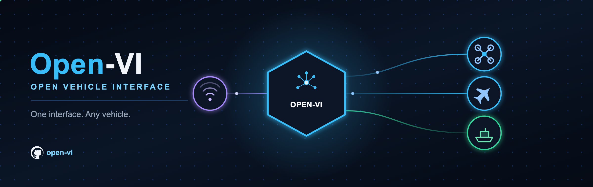

# open-vi



## Introduction

open-vi is an independent prototype: an ASK 5.0a Vehicle Interface. It is
owned by [OpenAutonomy](https://github.com/OpenAutonomy). It speaks native
UCI/A-GRA XML on the Abstract Service Bus.

It is one process: Isolator logic plus one vehicle backend behind
`PlatformPort`. Isolator owns A-GRA sequences, including the route ladder.
The default backend is `StubPlatform`. `Px4MavlinkAdapter` is a SITL cut
for telemetry and `WAYPOINT_FOLLOWING`. A new vehicle is a new adapter; it
is not a change to the Isolator.

Goals:

- Speak ASK 5.0a message types on the bus.
- Keep vehicle protocols (MAVLink, …) out of Isolator and codec.
- Extensibility: a new airframe is a `PlatformPort` implementation.

## Getting started

Clone the repository and install it. Python 3.11+ is required.

```bash
git clone https://github.com/OpenAutonomy/open-vi.git
cd open-vi
python3 -m venv .venv
source .venv/bin/activate
pip install -e ".[dev]"
```

Advertise once on an in-process bus (no broker):

```bash
open-vi --memory --once
```

That publishes `MA_FlightCapability` and prints the XML, then exits 0.

There is no authentication and no TLS on the live bus. See
[SECURITY.md](SECURITY.md).

`open-vi` connects to the ASB at `BROKER_HOST` (default localhost):

```bash
open-vi
```

Or the VI image:

```bash
BROKER_HOST=host.docker.internal docker compose -f compose/vi.yml up --build
```

CI publishes `ghcr.io/openautonomy/open-vi` from `main`. Either path
is Stub on STOMP `:61613`. PX4 SITL is `--platform px4` once a
vehicle is listening on `udpin:127.0.0.1:14540`. See
[docs/PX4.md](docs/PX4.md).

```bash
pytest
```

## Standards

UCI and A-GRA XSD documents are not in the tree. The codec builds
CAL-friendly XML and does not validate against the catalog. Namespace and
schema version are in `src/open_vi/codec/ns.py`.

## Documentation

Published at
[openautonomy.github.io/open-vi](https://openautonomy.github.io/open-vi/).

- [docs/FEATURES.md](docs/FEATURES.md) — ASK 5.0a VI coverage
- [docs/ARCHITECTURE.md](docs/ARCHITECTURE.md) — layers, ports, and an example path
- [docs/ISOLATOR.md](docs/ISOLATOR.md) — sequences, handlers, and `RouteStore`
- [docs/PLATFORM.md](docs/PLATFORM.md) — `PlatformPort` methods
- [docs/ADDING_A_VEHICLE.md](docs/ADDING_A_VEHICLE.md) — adding a backend
- [docs/CODEC.md](docs/CODEC.md) — parse and build
- [docs/ASB.md](docs/ASB.md) — STOMP and the in-memory bus
- [docs/PX4.md](docs/PX4.md) — PX4 SITL backend

## FAQs

1. [How much of the VI standard do we cover?](docs/FEATURES.md)
1. [How is the Vehicle Interface put together?](docs/ARCHITECTURE.md)
1. [How do I add a vehicle?](docs/ADDING_A_VEHICLE.md)
1. [What does Isolator own versus the platform?](docs/ISOLATOR.md)
1. [How do I run PX4 SITL?](docs/PX4.md)

## Contributing

See [CONTRIBUTING.md](CONTRIBUTING.md).

## Changelog

Notable changes are in [CHANGELOG.md](CHANGELOG.md).

## License

Licensed under the [MIT License](LICENSE). Open source and free to use.
