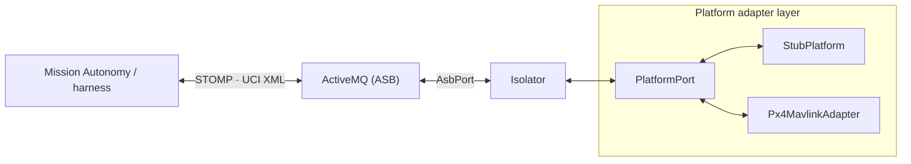
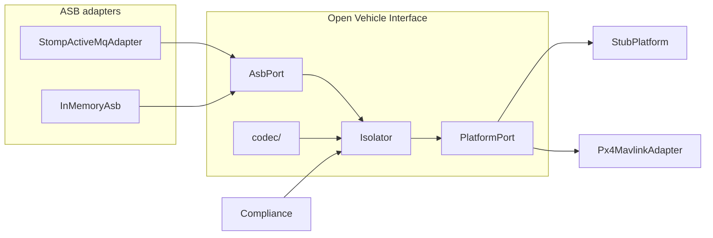

# Architecture

open-vi is an ASK 5.0a Level 1 **Vehicle Interface (VI)**. It speaks native
UCI/A-GRA XML on the Abstract Service Bus (ASB) and drives a vehicle through
an internal `PlatformPort`.

ASB detail: [ASB.md](ASB.md).  
Isolator detail: [ISOLATOR.md](ISOLATOR.md).  
Codec detail: [CODEC.md](CODEC.md).  
Platform detail: [PLATFORM.md](PLATFORM.md).  
PX4 backend: [PX4.md](PX4.md).

---

## Topology

Mission Autonomy (or the A-GRA test harness) and open-vi share an ActiveMQ
broker. open-vi is one process: Isolator logic plus a vehicle backend.

| Piece | Role |
| --- | --- |
| **Mission Autonomy / harness** | Peer on the bus; commands the VI, consumes status and TSPI |
| **ActiveMQ** | ASB transport (STOMP); topics named `/topic/<MessageType>` |
| **Isolator** | A-GRA sequences, accept/reject, outbound capability / status / TSPI |
| **Platform adapter layer** | `PlatformPort` plus vehicle backends (no UCI types) |
| **StubPlatform** | Default backend — deterministic state for harness and unit tests |
| **Px4MavlinkAdapter** | Thin SITL cut — telemetry + waypoint execute (arm/takeoff/mission) |

Only one backend is wired at a time. New vehicles add an adapter; they do not
replace the Isolator.

---

## Layered software architecture

### ASB port

Narrow bus face used by the Isolator: `connect` / `disconnect`, `subscribe`,
`publish`, and an inbound message callback. No STOMP types leak into Isolator
or codec code. Detail: [ASB.md](ASB.md).

| Adapter | Use |
| --- | --- |
| `StompActiveMqAdapter` | Live broker (`compose/asb.yml`) |
| `InMemoryAsb` | Unit tests and `--memory` |

### Codec

Parse and build official message types as CAL-friendly XML (default `xmlns`,
no `uci:` prefix). Lives under `src/open_vi/codec/`. Full XSD validation is not
required for the current Stub Isolator. Detail: [CODEC.md](CODEC.md).

### Isolator

Owns identity, session state, the tick loop, and inbound dispatch to handlers.
Handlers implement Core sequences (capability, flight commands, routes,
heartbeat, contingencies, query, system management). The Isolator never
imports vehicle protocols.

`COMPLIANCE_MODE=loose|strict` selects OPT status ladders (e.g.
`QUEUED`→`PROCESSING`→`COMPLETED`) without forking the codebase.

### Platform adapter layer

`PlatformPort` is the internal vehicle API (DTOs and methods for snapshot,
flight commands, vehicle state, routes, faults, QNH, …). Backends implement
it: **StubPlatform** (default) and **Px4MavlinkAdapter** (thin SITL:
telemetry + waypoint execute). The Isolator never imports vehicle
protocols; accept/reject for ICD rules uses platform readiness and command
results. Detail: [PLATFORM.md](PLATFORM.md), [PX4.md](PX4.md).
Adding a backend: [ADDING_A_VEHICLE.md](ADDING_A_VEHICLE.md).
