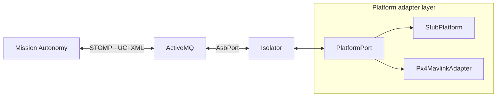
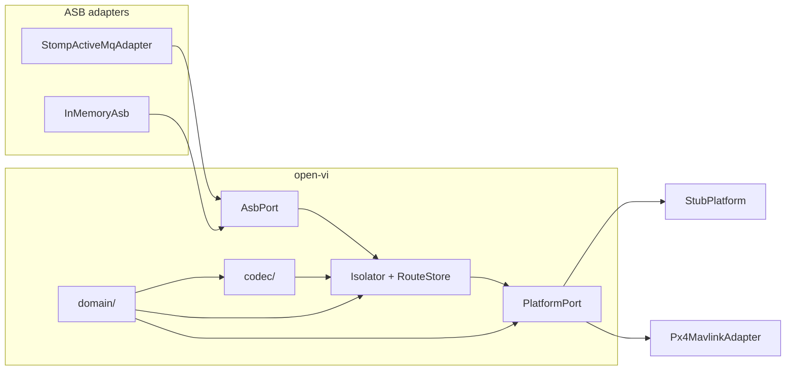

# Architecture

open-vi is one process: Isolator logic plus one vehicle backend. It speaks
native UCI/A-GRA XML on the Abstract Service Bus and drives the vehicle
through `PlatformPort`. Isolator owns A-GRA sequences. A new vehicle is a
new adapter; it is not a change to Isolator or the codec.

The bus face is in [ASB.md](ASB.md), sequences are in [ISOLATOR.md](ISOLATOR.md),
parse and build are in [CODEC.md](CODEC.md), the vehicle port is in
[PLATFORM.md](PLATFORM.md), and PX4 is in [PX4.md](PX4.md). How to add a
backend is in [ADDING_A_VEHICLE.md](ADDING_A_VEHICLE.md).

## Topology

Mission Autonomy and open-vi share an ActiveMQ broker. Topics are named
`/topic/<MessageType>`. Only one backend is wired at a time. Isolator
construction requires a `PlatformPort`; the CLI passes one via
`make_platform()`.

| Piece | Role |
| --- | --- |
| Mission Autonomy | Peer on the bus; commands the VI, consumes status and TSPI |
| ActiveMQ | ASB transport (STOMP) |
| Isolator | Sequences, accept/reject, route ladder and File*, outbound capability / status / TSPI |
| `PlatformPort` | Snapshot, flight command, TSPI, QNH, faults |
| `StubPlatform` | Default backend for tests and `open-vi` |
| `Px4MavlinkAdapter` | SITL: telemetry and `WAYPOINT_FOLLOWING` |

## Layers

`AsbPort` is `connect`, `disconnect`, `subscribe`, `publish`, and an inbound
callback. Isolator and codec do not import STOMP types.
`StompActiveMqAdapter` connects to the ASB at `BROKER_HOST`.
`InMemoryAsb` is unit tests and `open-vi --memory`.

`open_vi.domain` holds flight, TSPI, status, route, and control values.
There is no XML and no bus here. Degrees live in domain; radians begin at
the codec boundary.

The codec turns those values into CAL-friendly XML (default `xmlns`, no
`uci:` prefix) and back. It is not an XSD binding and does not validate
against the catalog.

Isolator owns identity, session state, `RouteStore`, the tick loop, and
dispatch to handlers. The default SystemID is `open-vi` under this
project's namespace UUID, not the official-harness SUT / 1 / nil parent. `Isolator.__init__` requires `platform: PlatformPort`.
It does not default to Stub and does not import Stub.
`COMPLIANCE_MODE=loose|strict` selects status-ladder length without forking
the handlers.

`PlatformPort` is snapshot, flight command, TSPI, status, faults, and QNH.
It does not own routes or File*. Backends implement the port. Isolator
accepts or rejects flight commands from platform readiness and command
results.
