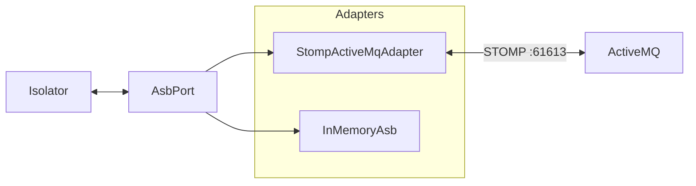

# ASB

The Abstract Service Bus is how open-vi exchanges UCI/A-GRA messages with
Mission Autonomy. Isolator depends only on `AsbPort`. It never imports
STOMP or ActiveMQ types. The layers around it are in
[ARCHITECTURE.md](ARCHITECTURE.md).

`message_type` is the UCI root name (for example `MA_FlightCommand`).
Adapters map it to `/topic/<MessageType>`.

| Method | Role |
| --- | --- |
| `connect` / `disconnect` | Session lifecycle |
| `subscribe(message_type)` | Listen for a UCI message type |
| `publish(message_type, xml)` | Send a UCI XML body |
| `on_message(handler)` | Register `(message_type, xml) → None` callbacks |

`StompActiveMqAdapter` is the live broker and the default when you run
`open-vi`. `InMemoryAsb` is unit tests and `open-vi --memory`.

Subscribe also registers `/topic/<MessageType><None>`. Some peers publish
to that alias. The STOMP adapter reconnects and resubscribes on
disconnect.

There is no authentication and no TLS. `compose/asb.yml` starts ActiveMQ
with no credentials. See [SECURITY.md](SECURITY.md).
