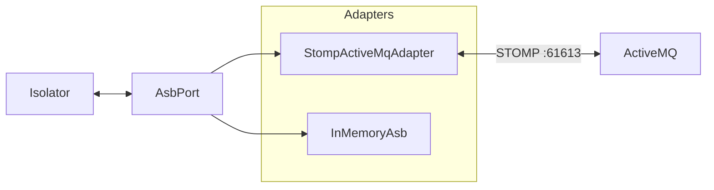

# ASB

The Abstract Service Bus (ASB) module is how open-vi exchanges UCI/A-GRA messages
with a Mission Autonomy instance (or the A-GRA test harness). Isolator code
depends only on `AsbPort` — never on STOMP or ActiveMQ types.

Parent: [ARCHITECTURE.md](ARCHITECTURE.md).

---

## Port



| Method | Role |
| --- | --- |
| `connect` / `disconnect` | Session lifecycle |
| `subscribe(message_type)` | Listen for a UCI message type |
| `publish(message_type, xml)` | Send a UCI XML body |
| `on_message(handler)` | Register `(message_type, xml) → None` callbacks |

`message_type` is the UCI root name (e.g. `MA_FlightCommand`). Adapters map it
to `/topic/<MessageType>`.

---

## Adapters

| Adapter | Use |
| --- | --- |
| `StompActiveMqAdapter` | Live broker; default when running `open-vi` |
| `InMemoryAsb` | Unit tests and `open-vi --memory` |

Subscriptions use a primary topic plus a harness-style `/topic/<MT><None>`
alias (`subscribe_aliases`). The STOMP adapter reconnects and resubscribes on
disconnect.

---

## Package

```text
src/open_vi/asb/
  port.py        # AsbPort protocol
  topics.py      # topic_dest / subscribe_aliases
  stomp_amq.py   # StompActiveMqAdapter
  memory.py      # InMemoryAsb
```
