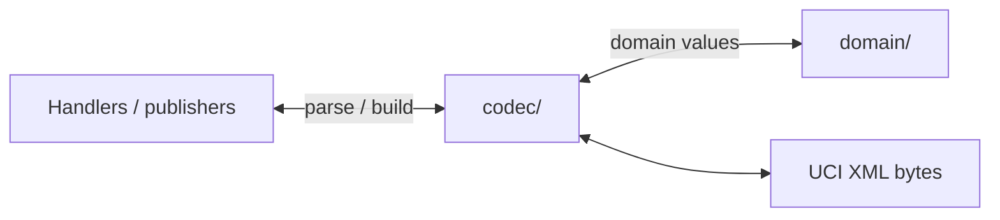

# Codec

The codec parses and builds UCI/A-GRA XML for Isolator handlers and
publishers. It turns a message-type document into `open_vi.domain` values
and the reverse. It is not an XSD binding and does not validate against
the catalog. The layers around it are in [ARCHITECTURE.md](ARCHITECTURE.md).



Handlers import builders and parsers from submodules:

```python
from open_vi.codec.capability import build_flight_capability
from open_vi.codec.command import parse_flight_commands
from open_vi.codec.mts import MT_FLIGHT_COMMAND
from open_vi.domain import FlightCommandRequest
```

The codec speaks `open_vi.domain`, not `open_vi.platform`.

The default `xmlns` is the OAM URI in `ns.py` (CAL-friendly; no `uci:`
prefix). Schema version is `005.0a`. Envelopes, ids, and security headers
are shared helpers in `xmlutil`. UCI `Point2D` and TSPI lat/lon are
radians on the wire; domain `Waypoint` and `TspiSnapshot` stay in
degrees. Convert at this boundary (`geo.py`).

| Module | Message types |
| --- | --- |
| `mts.py` | UCI root names (`MT_*`) for Isolator and tests |
| `capability.py` | `MA_FlightCapability`, `MA_FlightCapabilityStatus` |
| `command.py` | `MA_FlightCommand`, status, activity |
| `path.py` | Shared Path / Point2D waypoint parse and build |
| `vehicle_state.py` | TSPI outs (`MA_PositionReportDetailed`, `NavigationReport`, …) |
| `status.py` | `ServiceStatus`, `SubsystemStatus`, `MA_Fault` |
| `route.py` | Route plan / activation, File* |
| `notification.py` | `MA_SystemNotification`, `MA_Response` |
| `query.py` | `QueryDataRequest`, `AirfieldReport` |
| `system_mgmt.py` | `MA_SystemManagementRequest` |
| `control.py` | `MA_ControlRequest`, `MA_ControlAssignment` |
| `task.py` | `MA_TaskCommand`, `TaskStatus`, `MA_Task` |
| `control_status.py` | `ControlStatus`, `ResponsePlanExecutionStatus`, `RoutePlanExecutionStatus`, `MA_MissionPlanExecutionStatus` |
