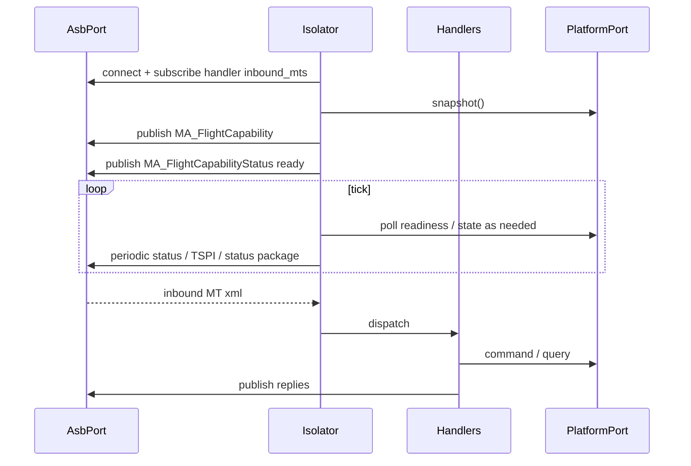

# Isolator

The Isolator is open-vi’s A-GRA **VI OMS Isolator** face: UCI XML on the ASB
toward Mission Autonomy, and `PlatformPort` toward the vehicle. It is the only
component that owns A-GRA sequences.

Parent: [ARCHITECTURE.md](ARCHITECTURE.md).

---

## Runtime



`Isolator.attach()` connects the bus, registers `dispatch`, and subscribes each
handler’s `inbound_mts`. `start()` attaches, advertises control, and runs the
tick loop. Handlers parse with `codec/`, call `PlatformPort`, and publish
replies. Missing request/response IDs are dropped.

---

## Package

```text
src/open_vi/isolator/
  executive.py      # Isolator lifecycle + dispatch
  publishers.py     # advertise, TSPI, status package, contingency outs
  compliance.py     # loose vs strict status ladders
  context.py        # bus, platform, identity, config, state
  state.py          # capability / activity session
  handlers/
    flight_command.py
    heartbeat.py
    route.py
    failsafe.py
    system_mgmt.py
    query.py
```

Related: `asb/`, `codec/`, `platform/`, `identity.py`, `config.py`.

---

## Handlers

Each handler declares `inbound_mts` (subscribed at `attach`) and maps one
concern: parse → `PlatformPort` → publish.

| Handler | Inbound | Outbound |
| --- | --- | --- |
| `flight_command` | `MA_FlightCommand` | `MA_FlightCommandStatus` (+ `MA_FlightActivity` if accepted) |
| `heartbeat` | `ServiceStatus`, `ServiceStatusDataRequest`, `SubsystemStatusDataRequest` | Matching status / request-status (fault / capability status as needed) |
| `route` | `MA_MissionPlanActivationCommand`, `MA_RoutePlan` | Activation status ladder; or notification + `FileLocation` + `FileMetadata` |
| `failsafe` | `MA_Response` | `MA_SystemNotification` |
| `system_mgmt` | `MA_SystemManagementRequest` | `MA_SystemManagementRequestStatus` |
| `query` | `QueryDataRequest` | `QueryDataRequestStatus` (loose/strict ladder) |

`COMPLIANCE_MODE=loose|strict` selects OPT status ladders on route and query.
Advertise, TSPI, status package, and Stub contingencies are outbound-only
(`publishers.py`), not handlers.

The Isolator does not import STOMP, ActiveMQ, MAVLink, or PX4. Vehicle
backends implement `PlatformPort` (see [PLATFORM.md](PLATFORM.md),
[PX4.md](PX4.md)). Stub-only contingency injection stays off that ABC.
