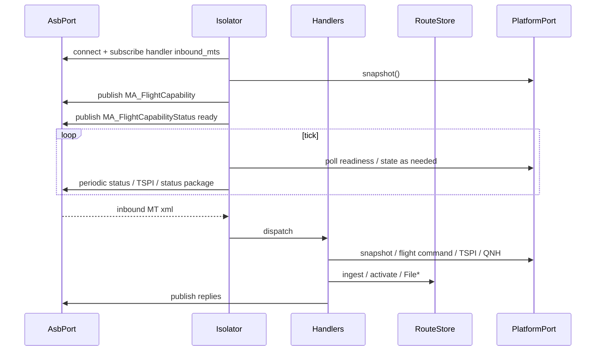

# Isolator

Isolator is the A-GRA face of open-vi: UCI XML on the bus toward Mission
Autonomy, and `PlatformPort` toward the vehicle. It is the only component
that owns sequences, including the route ladder and File*. The layers
around it are in [ARCHITECTURE.md](ARCHITECTURE.md).

`Isolator.__init__` requires `platform: PlatformPort`. The CLI passes one
via `make_platform()`. There is no default Stub, and Isolator does not
import Stub.

## Runtime

`attach()` connects the bus, registers `dispatch`, and subscribes each
handler's `inbound_mts`. `start()` attaches, advertises control, and runs
the tick loop. Handlers parse with the codec, call `RouteStore` and/or
`PlatformPort`, and publish replies. A message with no request or response
id is dropped.

## RouteStore

`src/open_vi/isolator/routes.py` sits next to session state. It retains
opaque `MA_RoutePlan` bytes and a sha256, and it advances
upload → prepare → activate → deactivate. `prime(...)` is for tests.

`IsolatorState.stored_route_ids` lists plans the query handler may emit.
The route and query handlers read and write `ctx.routes`, not
`ctx.platform`. ACTIVATE does not call the vehicle.

## Handlers

Each handler declares `inbound_mts` (subscribed at `attach`) and maps one
concern: parse, then `RouteStore` and/or `PlatformPort`, then publish.

| Handler | Inbound | Outbound |
| --- | --- | --- |
| `flight_command` | `MA_FlightCommand` | `MA_FlightCommandStatus` (and `MA_FlightActivity` if accepted; `MA_Task` if rejected) |
| `heartbeat` | `ServiceStatus`, `ServiceStatusDataRequest`, `SubsystemStatusDataRequest` | Matching status / request-status |
| `route` | `MA_MissionPlanActivationCommand`, `MA_RoutePlan`, `RoutePlanValidationCommand` | Activation status, notification, File*, validation |
| `failsafe` | `MA_Response` | `MA_SystemNotification` |
| `system_mgmt` | `MA_SystemManagementRequest` | `MA_SystemManagementRequestStatus` |
| `query` | `QueryDataRequest` | `QueryDataRequestStatus` plus capability, File*/`MA_RoutePlan`, or `AirfieldReport` |
| `control` | `MA_ControlRequest` | `MA_ControlRequestStatus` and `MA_ControlAssignment` |
| `task` | `MA_TaskCommand` | `MA_TaskCommandStatus` and `TaskStatus` |

Capability NEW starts an activity when idle. CANCEL stops it. Activity
UPDATE is the replan: it replaces the live path and republishes
`MA_FlightActivity` as `UPDATED`. A second Capability NEW while an
activity is live is rejected. ACTIVATE still does not call the vehicle.

`COMPLIANCE_MODE=loose|strict` selects status-ladder length on route and
query. Advertise, TSPI, the status package, and Stub contingencies are
outbound-only (`publishers.py`), not handlers.

Isolator does not import STOMP, ActiveMQ, MAVLink, or PX4. Vehicle
backends implement `PlatformPort` ([PLATFORM.md](PLATFORM.md),
[PX4.md](PX4.md)). Stub contingency injection stays off that ABC.
