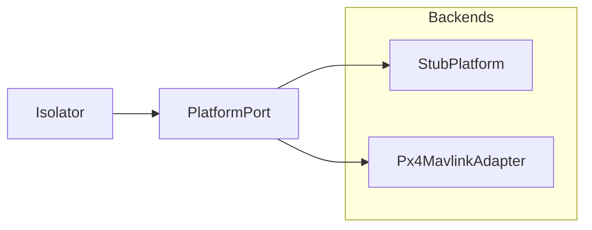

# Platform

The platform adapter layer is the Isolator’s vehicle face. `PlatformPort`
lives in `platform/port.py`. Shared dataclasses live in `open_vi.domain`.
Backends implement the port — **StubPlatform** and **Px4MavlinkAdapter**.
No UCI XML and no MAVLink types appear on this boundary.

Parent: [ARCHITECTURE.md](ARCHITECTURE.md).

---

## Role



Only one backend is wired into the Isolator at a time. Isolator construction
requires a `PlatformPort` (CLI: `make_platform()`). New vehicles add an
adapter; they do not change Isolator sequence logic and they do not
implement the A-GRA route ladder.

---

## PlatformPort

| Method | Role |
| --- | --- |
| `snapshot()` | Control offer + readiness (advertise / tick) |
| `submit_flight_command()` | Accept/reject flight capability commands |
| `poll_command_updates()` | Terminal command states since last poll (default: none) |
| `active_flight_activity()` | Current activity for `MA_FlightActivity` |
| `get_vehicle_state()` | TSPI / airdata / components (`TsipSnapshot`) |
| `get_service_status()` | VI service heartbeat fields |
| `get_subsystem_status()` | Subsystem health |
| `get_faults()` | Fault list (cleared sentinel OK) |
| `apply_system_management()` | QNH / system management → `COMPLETED` \| `REJECTED` |
| `close()` | Release backend resources (default no-op; PX4 closes MAVLink) |

DTOs (`FlightCommandRequest`, `CommandResult`, `TsipSnapshot`, …) are
`open_vi.domain` structs. The Isolator maps them to UCI via `codec/`.

**Not on the ABC:** the route ladder (`RouteStore` on the Isolator), and
`inject_contingency` (Stub/harness only — `StubPlatform.inject_contingency`
+ `Isolator.publish_contingency`).

---

## Backends

| Backend | Status | Role |
| --- | --- | --- |
| `StubPlatform` | Tests / CLI `--platform stub` | Deterministic state for harness and unit tests |
| `Px4MavlinkAdapter` | Thin SITL cut | Telemetry + WAYPOINT_FOLLOWING (upload, arm, takeoff, mission start) |

`import open_vi.platform` loads Stub and the port. PX4 is imported only
inside `make_platform("px4")`.

PX4 install, SITL, execute path, and smoke scripts: [PX4.md](PX4.md).
How to add another backend: [ADDING_A_VEHICLE.md](ADDING_A_VEHICLE.md).

---

## Package

```text
src/open_vi/domain/     # flight / tspi / status / route / control
src/open_vi/platform/
  port.py    # PlatformPort ABC
  stub.py    # StubPlatform
  px4.py     # Px4MavlinkAdapter (pymavlink; lazy import)
```
