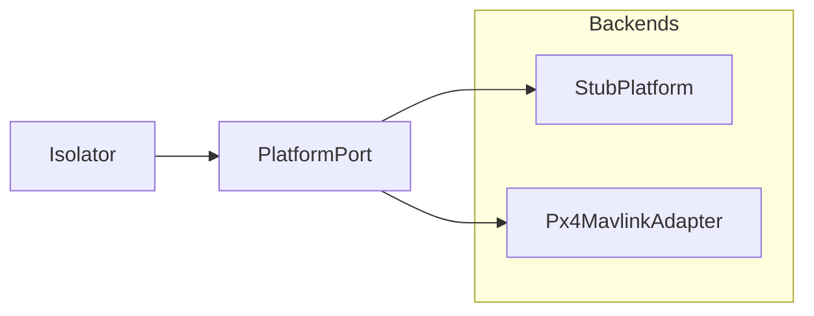

# Platform

The platform adapter layer is the Isolator’s vehicle face. Types and the
`PlatformPort` ABC live in `platform/port.py`. Backends implement that port —
**StubPlatform** and **Px4MavlinkAdapter**. No UCI XML and no MAVLink types
appear on this boundary.

Parent: [ARCHITECTURE.md](ARCHITECTURE.md).

---

## Role



Only one backend is wired into the Isolator at a time. New vehicles add an
adapter; they do not change Isolator sequence logic.

---

## PlatformPort

| Method | Role |
| --- | --- |
| `snapshot()` | Control offer + readiness (advertise / tick) |
| `submit_flight_command()` | Accept/reject flight capability commands |
| `active_flight_activity()` | Current activity for `MA_FlightActivity` |
| `get_vehicle_state()` | TSPI / airdata / components (`TsipSnapshot`) |
| `get_service_status()` | VI service heartbeat fields |
| `get_subsystem_status()` | Subsystem health |
| `get_faults()` | Fault list (cleared sentinel OK) |
| `handle_route_activation()` | Route upload → prepare → activate → deactivate |
| `store_route_plan()` / `get_stored_route()` | Retain `MA_RoutePlan` bytes for File* |
| `apply_system_management()` | QNH / system management → `COMPLETED` \| `REJECTED` |

DTOs (`FlightCommandRequest`, `CommandResult`, `RouteActivationRequest`, …)
are internal Python structs. The Isolator maps them to UCI via `codec/`.

**Not on the ABC:** `inject_contingency` — Stub/harness only
(`StubPlatform.inject_contingency` + `Isolator.publish_contingency`).

---

## Backends

| Backend | Status | Role |
| --- | --- | --- |
| `StubPlatform` | Current default | Deterministic state for harness and unit tests |
| `Px4MavlinkAdapter` | Thin SITL cut | Telemetry + WAYPOINT_FOLLOWING (upload, arm, takeoff, mission start) |

PX4 install, SITL, execute path, and smoke scripts: [PX4.md](PX4.md).
How to add another backend: [ADDING_A_VEHICLE.md](ADDING_A_VEHICLE.md).

---

## Package

```text
src/open_vi/platform/
  port.py    # PlatformPort ABC + DTOs
  stub.py    # StubPlatform
  px4.py     # Px4MavlinkAdapter (pymavlink)
```