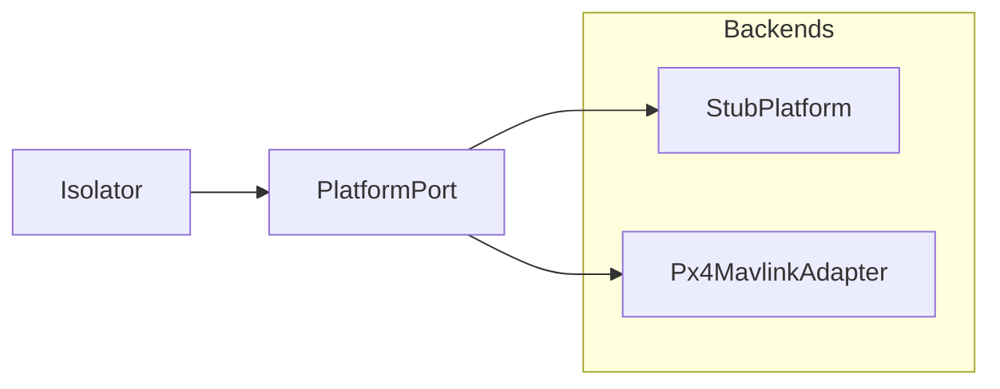

# Platform

`PlatformPort` is Isolator's vehicle face. Shared values live in
`open_vi.domain`. No UCI XML and no MAVLink types appear on this boundary.
The layers around it are in [ARCHITECTURE.md](ARCHITECTURE.md). A new
backend is a new implementation; see [ADDING_A_VEHICLE.md](ADDING_A_VEHICLE.md).

Only one backend is wired at a time. Isolator construction requires a
`PlatformPort` (CLI: `make_platform()`). Adapters do not implement the
A-GRA route ladder.

## Methods

| Method | Role |
| --- | --- |
| `snapshot()` | Control offer and readiness (advertise / tick) |
| `submit_flight_command()` | Accept or reject a flight capability command |
| `poll_command_updates()` | Terminal command states since last poll (default: none) |
| `active_flight_activity()` | Current activity for `MA_FlightActivity` |
| `get_vehicle_state()` | TSPI, airdata, components (`TspiSnapshot`) |
| `get_service_status()` | VI service heartbeat fields |
| `get_subsystem_status()` | Subsystem health |
| `get_faults()` | Fault list (a cleared sentinel is fine) |
| `apply_system_management()` | QNH → `COMPLETED` or `REJECTED` |
| `close()` | Release backend resources (default no-op; PX4 closes MAVLink) |

Isolator maps these domain structs to UCI through the codec. The route
ladder is `RouteStore` on Isolator, not this ABC. `inject_contingency` is
Stub-only and stays off the port.

## Backends

`StubPlatform` is the default for tests and `open-vi`. It is deterministic
state: accept/reject, TSPI, and status.

`Px4MavlinkAdapter` is telemetry and `WAYPOINT_FOLLOWING` (mission upload,
arm, takeoff, mission start). Install, SITL, and smoke scripts are in
[PX4.md](PX4.md).

`import open_vi.platform` loads the port and Stub. PX4 is imported only
inside `make_platform("px4")`.
