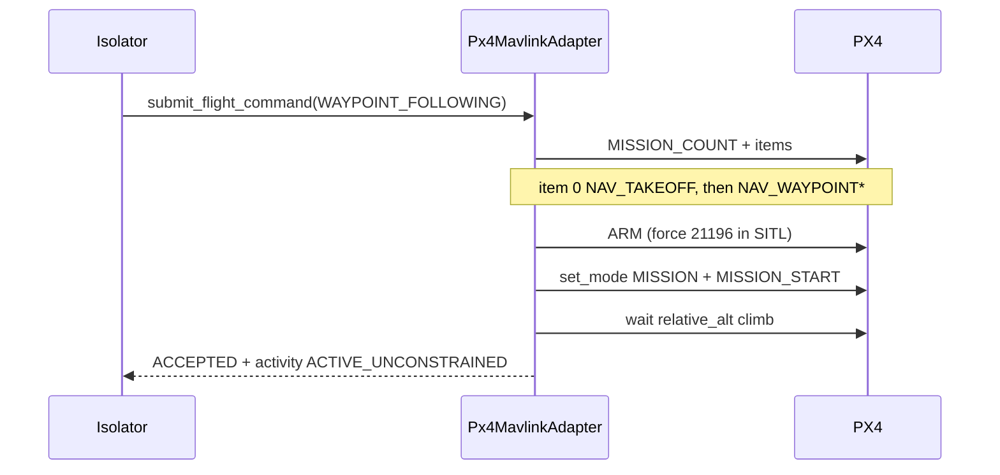

# PX4

`Px4MavlinkAdapter` is the PX4 / SITL backend behind `PlatformPort`. It
speaks MAVLink (pymavlink) to the vehicle and returns the same DTOs as
Stub. Isolator and codec never import MAVLink.

Parent: [PLATFORM.md](PLATFORM.md).

---

## Role


Arm, takeoff, and mission start are **adapter-internal**. Mission Autonomy
does not send UCI “arm” / “takeoff” messages; it sends `MA_FlightCommand`.
The adapter realizes an accepted `WAYPOINT_FOLLOWING` command on PX4.

---

## Install and SITL

```bash
pip install -e ".[px4]"          # or .[dev] (includes pymavlink)

# PX4 SITL (Docker SIH) — MAVLink API on UDP 14540
docker run -d --name open-vi-px4-sitl \
  -p 14550:14550/udp -p 14540:14540/udp \
  px4io/px4-sitl:latest

PYTHONPATH=src python scripts/px4_sitl_smoke.py
PYTHONPATH=src python scripts/isolator_px4_flight_smoke.py
open-vi --platform px4
```

| Setting | Default |
| --- | --- |
| CLI | `--platform px4` |
| Env platform | `VI_PLATFORM=px4` |
| MAVLink URL | `udpin:127.0.0.1:14540` (`--mavlink-url` or `PX4_MAVLINK_URL`) |
| SITL image | `px4io/px4-sitl` (SIH; home ≈ 47.40°N, 8.55°E) |

`--memory` Isolator is process-local: you cannot inject XML into a separate
`open-vi --memory` process. Use STOMP (`open-vi --platform px4` +
`compose/asb.yml`) for a live bus, or drive Isolator in-process as the
flight smoke script does.

---

## Waypoint execute

Accepted `WAYPOINT_FOLLOWING` → upload mission → arm → start MISSION → wait
until relative altitude shows climb. Rejects if the link is down, the mode
is not `WAYPOINT_FOLLOWING`, or waypoints are missing.

A-GRA `Point2D` altitude is HAE. PX4 mission items are relative to home.
Home HAE is `GLOBAL_POSITION_INT.alt − relative_alt`. The adapter subtracts
that from each waypoint; it does not guess from a 50 m threshold.



Standalone `TAKEOFF` mode / `NAV_TAKEOFF` command sits at PX4
`MIS_TAKEOFF_ALT` (~2.5 m on SIH). Embedding takeoff as mission item 0
then `MISSION_START` is the path that actually climbs.

Route activation uses the same local state machine as Stub (Isolator
sequences). It does **not** push the stored `MA_RoutePlan` to the vehicle.
QNH is applied locally to TSPI only.

---

## Telemetry and readiness

A reader thread ingests HEARTBEAT, GLOBAL_POSITION_INT, ATTITUDE, VFR_HUD,
and SYS_STATUS. `snapshot()` is `AVAILABLE` while heartbeat/position is
fresh (stale window 10 s); otherwise `TEMPORARILY_UNAVAILABLE` /
`PX4_LINK_DOWN`. `get_vehicle_state()` maps lat/lon/alt, NED speeds,
attitude, airspeed, heading, and battery → `TsipSnapshot`.

---

## Supported vs not

| In | Out / deferred |
| --- | --- |
| Heartbeat + TSPI | HSA_CSA / CurveFollowing (rejected) |
| WAYPOINT_FOLLOWING execute | Route ACTIVATE → vehicle mission push |
| Local route SM (Isolator) | QNH → PX4 params |
| Local QNH on TSPI | Reconnect / retry polish |

Unit tests mock MAVLink (`tests/test_platform_px4.py`). Live SITL is the
smoke scripts, not CI.

---

## Smoke scripts

| Script | Checks |
| --- | --- |
| `scripts/px4_sitl_smoke.py` | Connect, heartbeat, `AVAILABLE`, TSPI |
| `scripts/isolator_px4_flight_smoke.py` | In-process Isolator + memory ASB: `MA_FlightCommand` → Status ACCEPTED + Activity + climb |

---

## Package

```text
src/open_vi/platform/px4.py     # Px4MavlinkAdapter
src/open_vi/platform/__init__.py  # make_platform("px4")
scripts/px4_sitl_smoke.py
scripts/isolator_px4_flight_smoke.py
tests/test_platform_px4.py
```
