# open-vi

open-vi is an independent prototype: an ASK 5.0a Vehicle Interface. It
is one process — Isolator logic plus one vehicle backend behind
`PlatformPort`. Isolator owns A-GRA sequences. The default backend is
`StubPlatform`. A new vehicle is a new adapter.

Install and run from the
[repository README](https://github.com/OpenAutonomy/open-vi#getting-started).

## Documentation

- [Architecture](ARCHITECTURE.md) — layers, ports, and an example path
- [Isolator](ISOLATOR.md) — sequences, handlers, and `RouteStore`
- [Platform](PLATFORM.md) — `PlatformPort` methods
- [Adding a vehicle](ADDING_A_VEHICLE.md) — adding a backend
- [Codec](CODEC.md) — parse and build
- [ASB](ASB.md) — STOMP and the in-memory bus
- [PX4](PX4.md) — PX4 SITL backend
- [API](api.md) — generated from source docstrings
