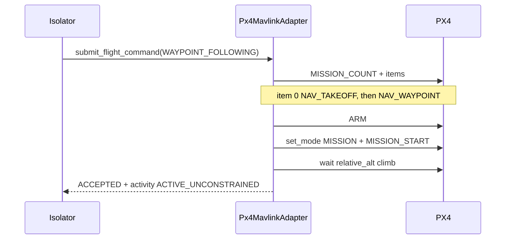

# PX4

`Px4MavlinkAdapter` is the PX4 / SITL backend behind `PlatformPort`.
It speaks MAVLink (pymavlink) and returns the same `open_vi.domain`
types as Stub. Isolator and codec never import MAVLink.


The port contract is in [PLATFORM.md](../../PLATFORM.md). What this
adapter covers versus Isolator is in [FEATURES.md](FEATURES.md).

The adapter does telemetry, `WAYPOINT_FOLLOWING`, and `HSA_CSA`.
Arm, takeoff, and mission start stay inside the adapter. Mission
Autonomy sends `MA_FlightCommand`, not UCI arm or takeoff.
Capability NEW starts a mission or offboard hold when idle. Activity
UPDATE is the replan: waypoint replace reuses the airborne path
(hold, drop prefix waypoints, skip takeoff); HSA replaces the live
vector. Both keep the live `activity_id`. A second Capability NEW
while airborne is rejected.

Before upload, the adapter checks the path against a
relative-altitude envelope (default 10–500 m AGL;
`PX4_MIN_REL_ALT_M` / `PX4_MAX_REL_ALT_M`). Rejects use Volume
`ValidationResult` (`INVALID_WAYPOINT`,
`PERFORMANCE_LIMIT_EXCEEDED`, `CAPABILITY_NOT_SUPPORTED`). The same
limits are advertised on `MA_FlightCapability` as
`WaypointFollowingPerformanceProfile` and
`HSA_CSA_PerformanceProfile` (HAE once home is known, otherwise
AGL). `apply_system_management` writes `SENS_BARO_QNH` and the
local TSPI snapshot.

`HSA_CSA` streams `SET_POSITION_TARGET_LOCAL_NED` in OFFBOARD at
about 10 Hz. Supported this slice: groundspeed, true-north heading
or course, and AGL or HAE altitude. Omitted axes hold current
telemetry. Empty `HSA_CSA` is a hold-current enter. CANCEL stops
the stream and holds. HSA is not a finite path — it does not
complete from `MISSION_ITEM_REACHED`.

Isolator owns the route ladder. ACTIVATE parses stored
`MA_RoutePlan` waypoints and submits `WAYPOINT_FOLLOWING` on this
adapter the same way a direct `MA_FlightCommand` does. The adapter
does not store or parse UCI plans.

`import open_vi.platform` does not load this module.
`make_platform("px4")` imports it.

## Install and SITL

Install pymavlink (`pip install -e ".[px4]"`; `.[dev]` already
includes it). Start PX4 SITL so MAVLink is on UDP 14540:

```bash
docker run -d --name open-vi-px4-sitl \
  -p 14550:14550/udp -p 14540:14540/udp \
  px4io/px4-sitl:latest
```

The image home is about 47.40°N, 8.55°E. Then:

```bash
open-vi --platform px4
```

`--platform px4` and `VI_PLATFORM=px4` select the backend. The
MAVLink URL defaults to `udpin:127.0.0.1:14540` (`--mavlink-url`
or `PX4_MAVLINK_URL`). Acceptance radius defaults to 15 m
(`path_clearance_m` or `PX4_PATH_CLEARANCE_M`). That is this
adapter's capture disk, not a shared Mission Autonomy constant.
Relative-altitude envelope defaults to 10–500 m AGL
(`PX4_MIN_REL_ALT_M`, `PX4_MAX_REL_ALT_M`).

`open-vi --memory` is process-local. For a live bus,
`open-vi --platform px4` connects over STOMP.

An accepted `WAYPOINT_FOLLOWING` is rejected first when the path is
empty, a point is non-finite, or relative altitude is outside the
envelope. Those rejects never start a mission.

## Waypoint execute

An accepted `WAYPOINT_FOLLOWING` uploads a mission, arms, starts
MISSION, and waits until relative altitude shows climb. An Activity
UPDATE with the live `ActivityID` runs the same upload without
minting a new activity. The command is rejected if the link is
down, the path fails the envelope check, or Activity is not UPDATE
against the live id.

## HSA execute

An accepted `HSA_CSA` arms (and takes off if still on the ground),
primes offboard setpoints, switches OFFBOARD, and streams
heading × groundspeed plus AGL. Activity UPDATE replaces the live
vector without minting a new activity. CANCEL stops the stream and
holds. TAS, magnetic heading, Mach, and MSL/barometric altitude
are `REJECTED`. `CURVE_FOLLOWING` stays `CAPABILITY_NOT_SUPPORTED`.

A-GRA `Point2D` altitude is HAE. PX4 mission items are relative to
home. Home HAE is `GLOBAL_POSITION_INT.alt − relative_alt`. The
adapter subtracts that from each waypoint.



A standalone PX4 TAKEOFF mode sits at `MIS_TAKEOFF_ALT`. Embedding
takeoff as mission item 0 and then `MISSION_START` is the path that
climbs. `apply_system_management` writes `SENS_BARO_QNH` (hPa) and
the local TSPI snapshot (`kollsman_hpa`). Link down or a missing
param ack is `REJECTED`.

## Telemetry

A reader thread ingests HEARTBEAT, GLOBAL_POSITION_INT, ATTITUDE,
VFR_HUD, and SYS_STATUS. `snapshot()` is `AVAILABLE` while
heartbeat and position are fresher than 10 s; otherwise
`TEMPORARILY_UNAVAILABLE` / `PX4_LINK_DOWN`.
`get_vehicle_state()` maps lat/lon/alt, NED speeds, attitude,
airspeed, heading, and battery into `TspiSnapshot`.

## Tests

Unit tests mock MAVLink (`tests/test_platform_px4.py`). They are
not live SITL and are not gated on a vehicle.
